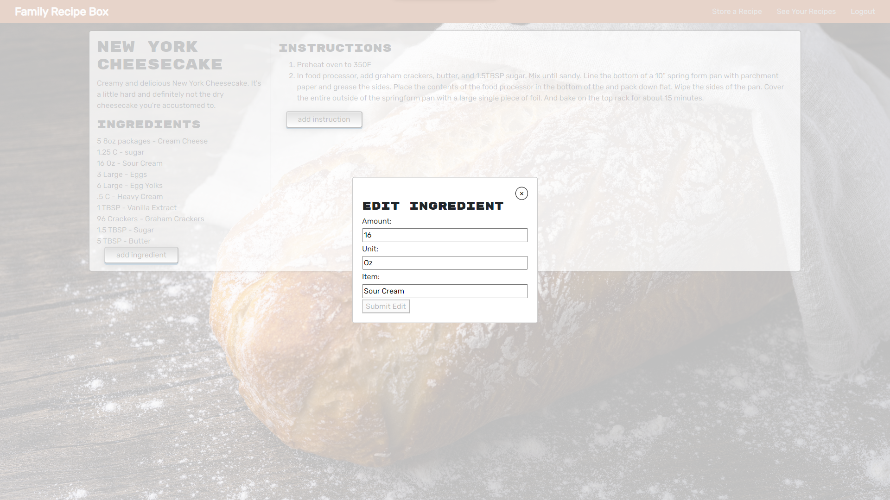

# Family Recipe Box

## Description

A single place to save all of your family recipes.

## Table of Contents

- [Installation](#installation)
- [Usage](#usage)
- [Links](#link)
- [Images](#images)
- [License](#license)
- [Contributing](#contributing)
- [Tests](#tests)
- [Questions](#questions)

## Installation

Go to site, sign up, and start saving your recipes.

## Usage

Click on store a recipe, enter recipe title and description, then move on to add ingredients, then add directions. Then you can view all of your saved recipes. There you can view a single recipe. And in the recipe view screen, you can edit any of the recipe components or add more ingredients or instructions.

## Links

[Family Recipe Box](https://family-recipe-box-8675309.herokuapp.com/) 
[GitHub Repository](https://github.com/hvansalisbury/Family-Recipe-Box)

## Images

## License

This application is covered under the [MIT License](https://choosealicense.com/licenses/mit) license.

## Contributing

At this time, I am not looking for any additional contributors for this project.

## Tests

Go through the entire app and make sure everything that gets saved is available as well as the ones you delete are no longer available.

## Questions

Should you have any questions, please [email](vansal51@yahoo.com) me and reach out to me on my [Github Profile](https://github.com/hvansalisbury)
